# PathFinder AI - Your Personal AI Learning Companion

> 🏆 Submitted for PLP Hackathon 3.0 - September 2025
> 
> This project has been developed and submitted according to the PLP Hackathon 3.0 guidelines, focusing on creating impactful solutions for African tech education.

PathFinder AI is a Next.js application designed to provide **personalized, accessible, and AI-powered lifelong learning**, tailored to individual goals and the evolving job market, with a special focus on empowering learners in Africa.

## Desktop View Screenshots
### Dashboard
[Dashboard](image.png)

### Learning Analytics - Basic
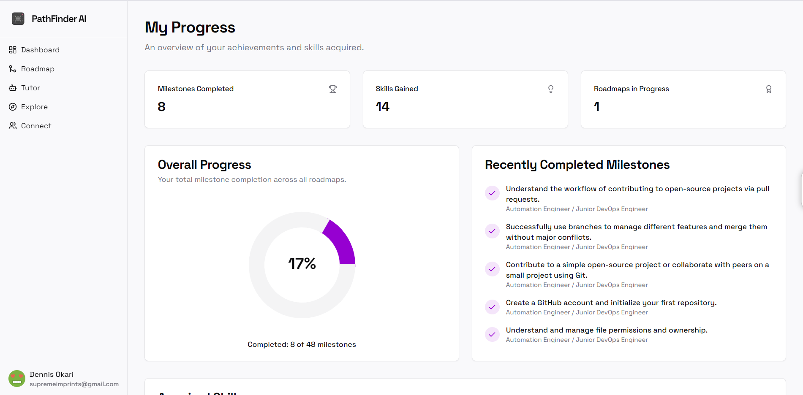

### Learning Analytics - Pro
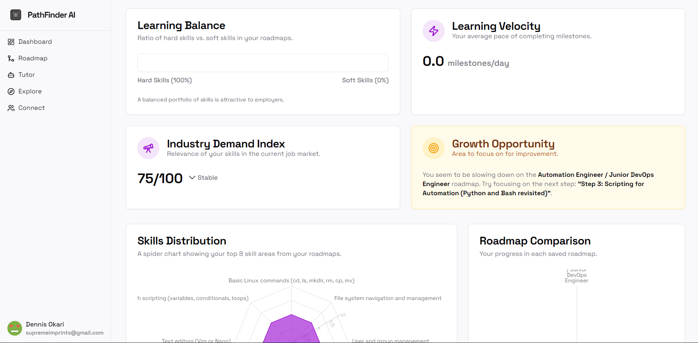

### AI Generated Roadmap
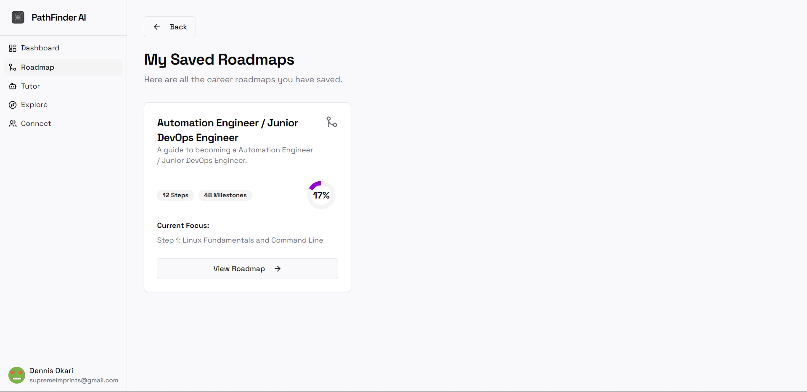

### Roadmap/Curriculum Progress
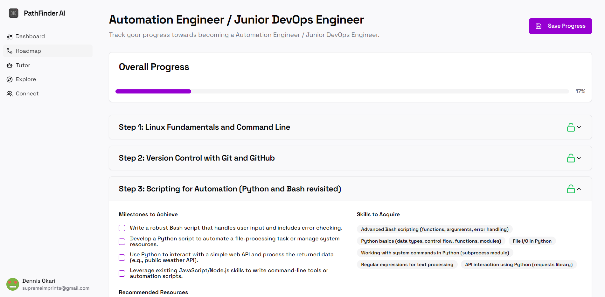

### AI Micro-Tutor 
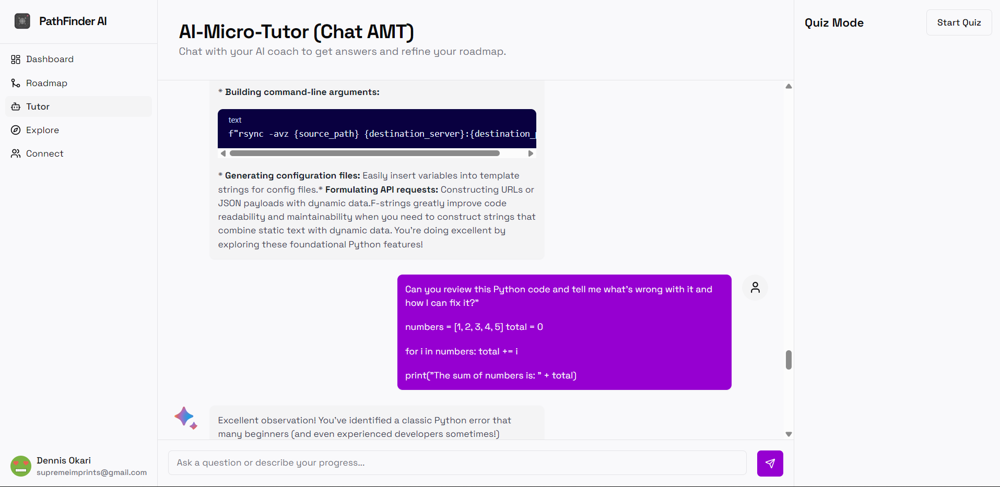

### AI Quiz Mode
Generates quizzes based on milestone progress, skills progress, Specific Custom Topics
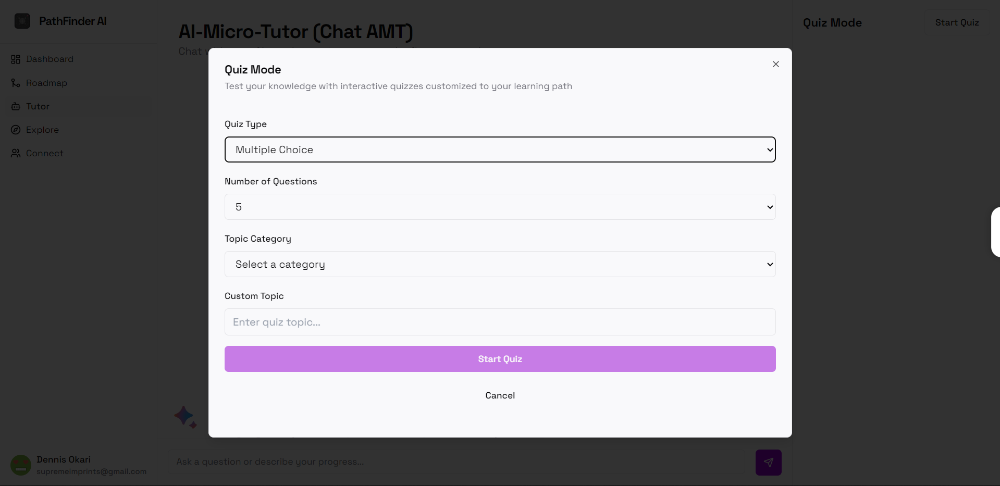
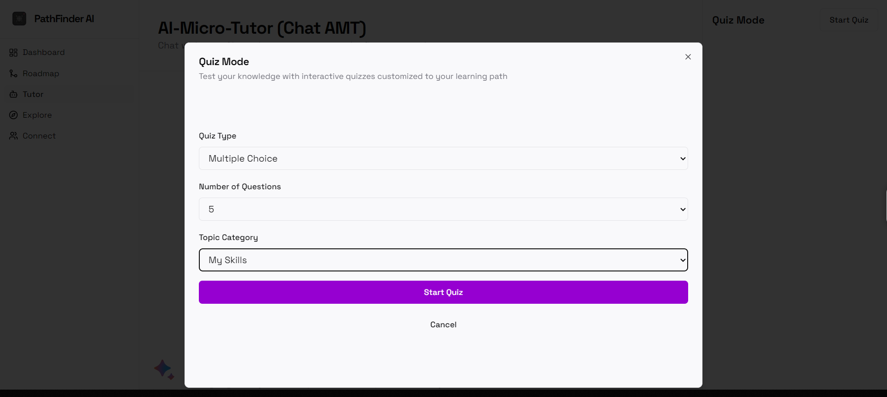
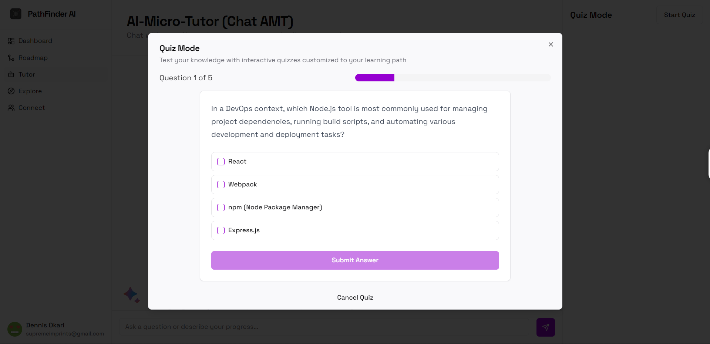

### Explore other Roadmaps
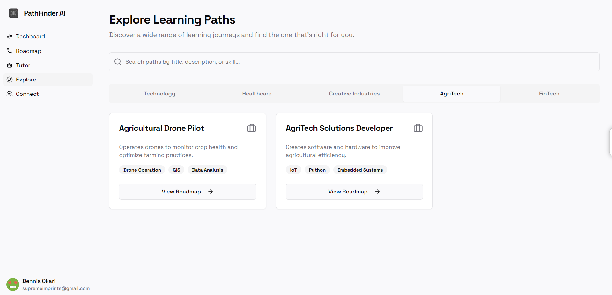

### Join a community or connect with a mentor

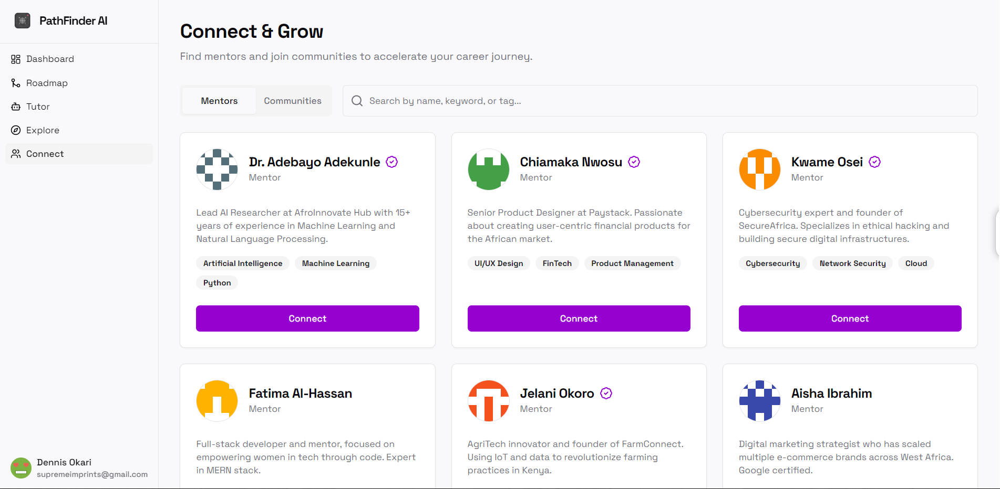
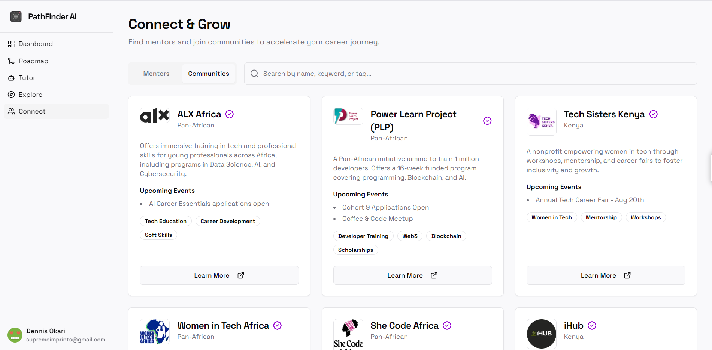

### Profile & Settings
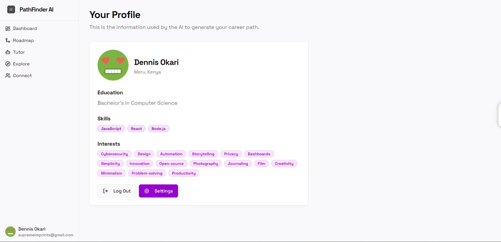
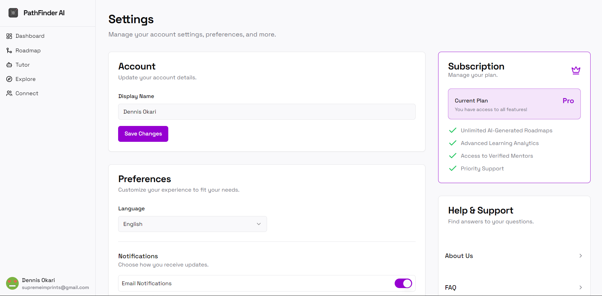

## 💙 Mission & Alignment with SDG 4

In line with **UN Sustainable Development Goal 4 (Quality Education)**, PathFinder AI is built to provide inclusive and equitable quality education and promote lifelong learning opportunities for all. We are not just a career guidance tool; we are a lifelong learning assistant.

-   **Equitable Access:** We provide **3 free, personalized learning roadmaps** to anyone, anywhere, curating high-quality, free resources like open-source courses, YouTube tutorials, and community content.
-   **Personalized Quality Education:** Our AI generates customized learning journeys that adapt to different educational levels and goals—from students to professionals upskilling for the future.
-   **Lifelong Learning:** We support continuous education, whether it's acquiring new hard skills, developing soft skills, or pursuing entrepreneurship.
-   **Inclusivity & Community:** We foster peer-to-peer learning through mentor and community connections, filling gaps left by formal education systems. We support multiple languages and offer accessibility features.

## ✨ Features

### Core Features
-   **AI-Powered Learning Suggestions:** Get personalized learning path recommendations based on your skills, interests, and aspirations.
-   **Dynamic Roadmap Generation:** Generate step-by-step learning roadmaps for any chosen skill or career path.
-   **Progress Tracking & Analytics:** Monitor your progress with basic tracking for free. Pro users get advanced analytics.
-   **AI Monthly Check-ins:** Chat with an AI coach to refine your roadmap and stay motivated.
-   **Community & Mentor Connect:** Discover tech communities and find mentors to guide you.

### Pro Features
-   **Unlimited Roadmaps:** Generate as many career and skill roadmaps as you need
-   **Advanced Analytics:** Detailed progress tracking, skill mastery visualization, and readiness assessments
-   **Verified Mentors:** Direct access to experienced professionals in your field
-   **Priority Support:** Get help when you need it most
-   **Ad-Free Experience:** Focus on your learning without distractions

## 💰 Subscription Plans

We offer flexible plans to suit different needs while keeping core features accessible:

### Free Plan
-   3 AI-generated roadmaps
-   Basic progress tracking
-   Access to community features
-   AI-powered learning suggestions

### Pro Plan
-   Monthly (KES 200/month) or Annual (KES 3,500/year)
-   All free features plus:
    -   Unlimited roadmap generation
    -   Advanced analytics & tracking
    -   Access to verified mentors
    -   Priority support
    -   Ad-free experience

### One-Off Purchases
-   Single roadmap generation (KES 100)
-   Perfect for specific career paths
-   Includes all features for that roadmap

## 🚀 Tech Stack & Development Tools

### Core Technologies
-   **Framework:** [Next.js](https://nextjs.org/) (with App Router)
-   **Language:** [TypeScript](https://www.typescriptlang.org/)
-   **Styling:** [Tailwind CSS](https://tailwindcss.com/)
-   **UI Components:** [ShadCN UI](https://ui.shadcn.com/)
-   **AI:** [Google AI & Genkit](https://firebase.google.com/docs/genkit)
-   **Authentication & Database:** [Firebase Auth & Firestore](https://firebase.google.com/)
-   **Payments:** [Paystack](https://paystack.com/) with M-Pesa integration
-   **Push Notifications:** Web Push API with service workers

### Development Tools
-   **IDE:** Visual Studio Code with GitHub Copilot
-   **Version Control:** Git & GitHub
-   **API Testing:** Postman, Thunder Client
-   **Database Management:** Firebase Studio
-   **Deployment:** Vercel
-   **Local Development:**
    - Firebase Emulator Suite
    - ngrok for webhook testing
    - Chrome DevTools
-   **Documentation:** Markdown, Excalidraw

### Module Licensing
All dependencies used in this project are open-source and properly licensed:

-   **Production Dependencies:**
    - Next.js (MIT License)
    - React (MIT License)
    - Tailwind CSS (MIT License)
    - Firebase (Apache-2.0 License)
    - ShadcnUI (MIT License)
    - All other npm packages use MIT, Apache-2.0, or ISC licenses

-   **Development Dependencies:**
    - TypeScript (Apache-2.0 License)
    - ESLint (MIT License)
    - Prettier (MIT License)

No proprietary or restricted-license modules are used in this project.

## 🛠️ Getting Started

### Prerequisites
- Node.js 18+ and npm
- A Firebase project
- A Paystack account
- (Optional) ngrok for webhook testing

### 1. Clone and Install
```bash
git clone https://github.com/geoffreymagana/PLP-Hackathon-3.0.git
cd PLP-Hackathon-3.0
npm install
```

### 2. Environment Setup
Create `.env.development` and `.env.production` files:

```env
# App
NEXT_PUBLIC_APP_URL=http://localhost:9002

# Firebase
NEXT_PUBLIC_FIREBASE_API_KEY=your_api_key
NEXT_PUBLIC_FIREBASE_AUTH_DOMAIN=your_auth_domain
NEXT_PUBLIC_FIREBASE_PROJECT_ID=your_project_id
NEXT_PUBLIC_FIREBASE_STORAGE_BUCKET=your_storage_bucket
NEXT_PUBLIC_FIREBASE_MESSAGING_SENDER_ID=your_sender_id
NEXT_PUBLIC_FIREBASE_APP_ID=your_app_id

# Paystack
NEXT_PUBLIC_PAYSTACK_PUBLIC_KEY=your_public_key
PAYSTACK_SECRET_KEY=your_secret_key
PAYSTACK_WEBHOOK_SECRET=your_webhook_secret

# Push Notifications
NEXT_PUBLIC_VAPID_PUBLIC_KEY=your_vapid_public_key
VAPID_PRIVATE_KEY=your_vapid_private_key
```

### 3. Firebase Setup

1. Create a new Firebase project
2. Enable Authentication with Google provider
3. Set up Firestore Database
4. Add your domain to authorized domains:
   ```
   Firebase Console -> Authentication -> Settings -> Authorized Domains
   ```

### 4. Paystack Setup

1. Create a Paystack account
2. Set up your business profile and KYC
3. Configure webhook URL:
   ```
   https://your-domain.com/api/payments/webhook
   ```
4. Enable M-Pesa payment channel
5. Set up your pricing plans in the dashboard

### 5. Development

Run the development server:
```bash
npm run dev
```

For webhook testing with ngrok:
```bash
npm install -g ngrok
ngrok http 9002
```

Update your Paystack webhook URL with the ngrok URL.

### 6. Build and Deploy

```bash
npm run build
npm start
```

## 🗺️ Project Structure

```
src/
├── ai/              # AI flows and Genkit integration
├── app/             # Next.js 13+ app directory
│   ├── (auth)/     # Authentication routes
│   └── (main)/     # Main application routes
├── components/      # Reusable React components
├── context/        # React context providers
├── hooks/          # Custom React hooks
├── lib/           # Utility functions and configurations
└── services/      # External service integrations
```

## 🔒 Security Features

- Secure payment processing with Paystack
- Firebase Authentication and security rules
- Webhook signature verification
- Environment variable protection
- Type-safe API routes
- Protected user data and roadmaps

## 📝 License & Attribution

This project is licensed under the MIT License - see the [LICENSE](LICENSE) file for details.

### Hackathon Submission
This project was developed as part of the PLP Hackathon 3.0 and has been submitted in accordance with all hackathon guidelines and requirements. The solution addresses the challenge of making quality tech education more accessible across Africa.

### Third-Party Assets
- All community logos and images are used with permission
- Icons provided by [Lucide Icons](https://lucide.dev/) (MIT License)
- UI Components based on [shadcn/ui](https://ui.shadcn.com/) (MIT License)

## 🙏 Acknowledgments

- Power Learn Project (PLP) for organizing the hackathon
- The open-source community for the amazing tools and libraries
- All mentors and judges for their valuable feedback
- Firebase team for the excellent documentation and tools
- Paystack team for payment integration support
